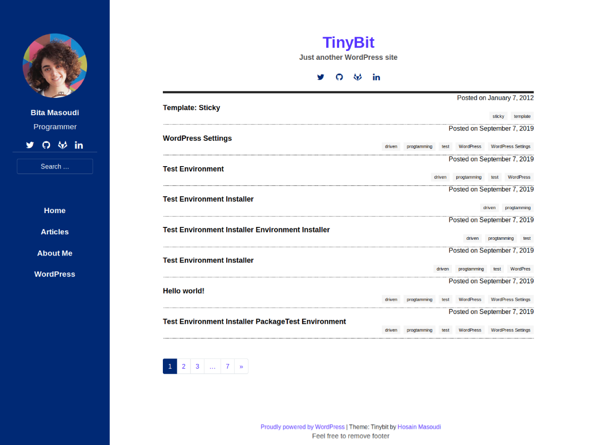

# Tinybit

### Screenshot:

# About Tinybit WordPress Theme

It is a simple blog for developers, programmers and etc who want share their ideas in a Wordpress blog.

## License
Tinybit is distributed under the terms of the GNU GPL version 2

http://www.gnu.org/licenses/old-licenses/gpl-2.0.en.html

## Installation

- Download the tinybit folder from GitHub or from [https://github.com/Hossein52Hz/tinybit](https://github.com/Hossein52Hz/tinybit)
- IMPORTANT: If you download it from GitHub make sure you rename the "tinybit-master.zip" file just to "tinybit.zip".
- Upload it into your WordPress installation theme subfolder: `/wp-content/themes/`
- Login to your WordPress dashboard
- Go to Appearance → Themes
- Activate the Tinybit theme

## RTL styles?
Not now.

The `blank.php` template is useful when working with various page builders and can be used as a starting blank canvas.

### Full Width Template

The `fullwidthpage.php` template has full width layout without a sidebar.

Licenses & Credits
=
- Tinybit theme is based on Understrap: https://understrap.com/ (
UnderStrap WordPress Theme, Copyright 2013-2018 Holger Koenemann UnderStrap is distributed under the terms of the GNU GPL version 2)
- Main Graphic Design is based on https://github.com/roryg/ghostwriter (under MIT License)
- Font Awesome: http://fontawesome.io/license (Font: SIL OFL 1.1, CSS: MIT License)
- Bootstrap: http://getbootstrap.com | https://github.com/twbs/bootstrap/blob/master/LICENSE (Code licensed under MIT documentation under CC BY 3.0.)
and of course
- jQuery: https://jquery.org | (Code licensed under MIT)
- WP Bootstrap Navwalker by Edward McIntyre: https://github.com/twittem/wp-bootstrap-navwalker | GNU GPL
- Bootstrap Gallery Script based on Roots Sage Gallery: https://github.com/roots/sage/blob/5b9786b8ceecfe717db55666efe5bcf0c9e1801c/lib/gallery.php

